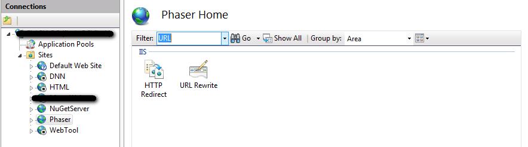
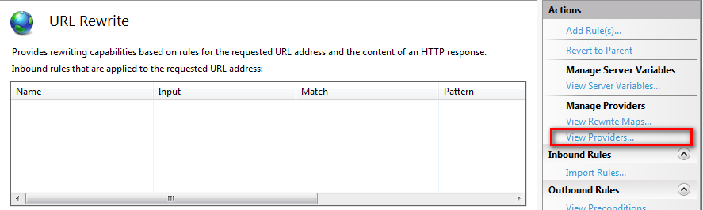
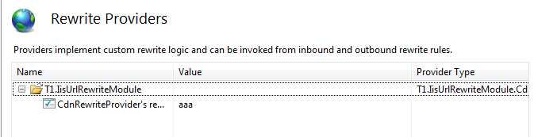

Create Custom IIS URL Rewrite Provider
---

Developing a Custom Rewrite Provider for URL Rewrite Module

### Creating a Visual Studio C# Class Library Project
* add references to Microsoft.Web.Iis.Rewrite.dll located in "%ProgramFiles%\Reference Assemblies\Microsoft\IIS".

Rewrite providers must be placed in the .NET Global Assembly Cache (GAC)

* To sign the assembly, In the Signing tab check "Sign the assembly" check box.  

In the combo box, select the option <New…> to create a new key. In the "Create Strong Name Key" dialog, type DemoKey.snk as the name for the key and uncheck the Protect my key file with a password check box. Click OK.

* Select the "Build Events" tab and add the following "Post-build event" command line:

CALL "%VS90COMNTOOLS%\vsvars32.bat" > NULL 
gacutil.exe /if "$(TargetPath)" 

Note: if you use Visual Studio 2010 then replace %VS90COMNTOOLS% with %VS100COMNTOOLS%.

### Implementing the provider interfaces

	public class CdnRewriteProvider : IRewriteProvider, IProviderDescriptor
	{
	}

### Registering and configuring the provider

* Open IIS Manager and select the URL Rewrite feature

This completes the registration and configuration of a rewrite provider. As a result the web.config file for the default web site will contain the following XML code inside of the <rewrite> section:

	<system.webServer>
		<rewrite>
			<providers>
				<provider name="T1.IisUrlRewriteModule" type="T1.IisUrlRewriteModule.CdnRewriteProvider, T1.IisUrlRewriteModule, Version=1.0.0.0, Culture=neutral, PublicKeyToken=cd92a3df2f0d20b9">
					<settings>
						<add key="config" value="aaa" />
					</settings>
				</provider>
			</providers>
		</rewrite>
	</system.webServer>