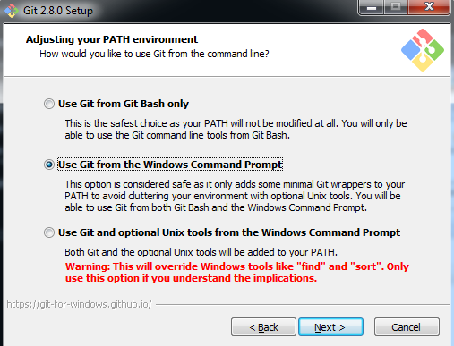
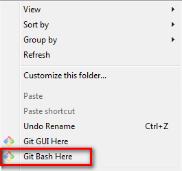
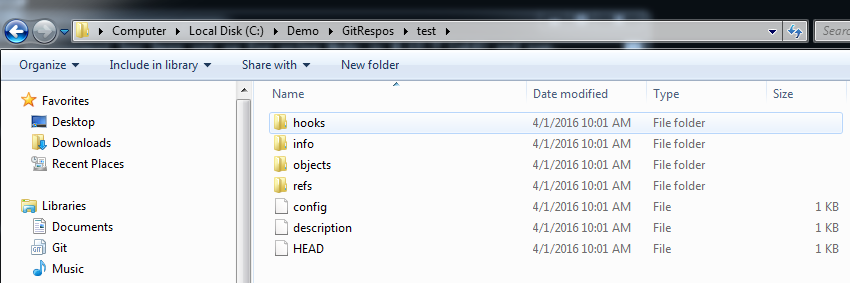

Install Git Server on Windows
---

Download "Git 2.8.0 for Windows" from [git-scm site](https://git-scm.com/) 
Download Bitvise SSH Server (WinSSHD) 6.45 from [bitvise](https://www.bitvise.com/download-area)

Install Git for windows and setup login account

Create Git Repos Root Folder

	D:/Demo/GitRepos

Create test folder and open bash command 

	C:/User/vdevp/GitRepos>md test
	

	vdevp@vdevp-PC MINGW64 /c/User/vdevp/GitRepos/test
	$ git init --bare

Git will create many initialize files

Go to your client PC and create test folder 

	D:/Demo/test

open Git bash command

	$ git clone ssh://vdevp@192.168.2.3/~/GitRepos/test
	Cloning into 'test'...
	vdevp@192.168.2.3's password:
	'git-upload-pack' is not recognized as an internal or external command, operable program or batch file.
	fatal: Could not read from remote repository.

	Please make sure you have the correct access rights and the repository exists.
	

If you see the error message, please go to Server add system PATH environment 

	C:\Program Files (x86)\Git\bin;C:\Program Files\Git\mingw64\libexec\git-core

